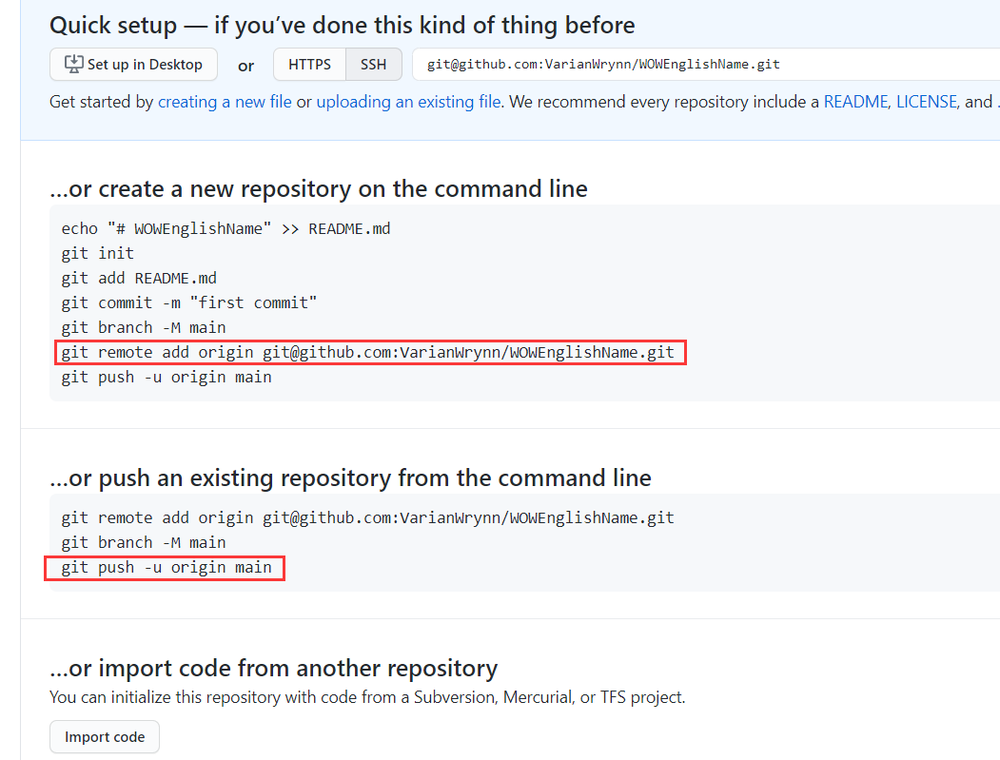

# Github入门笔记-PartG  Origin 别名理解
@(读书笔记组)[GitHub, GitHub 101, GitHub 漫游指南, Git工作流程, Github入门笔记]


[toc]


* [Github入门笔记\-PartG  Origin 别名理解](#github入门笔记-partg--origin-别名理解)
  * [1\. 起因](#1-起因)
  * [2\. Origin到底是什么?](#2-origin到底是什么)
    * [2\.1 回答1](#21-回答1)
    * [2\.2 回答2 （更容易理解）](#22-回答2-更容易理解)
  * [3\. 本地别名的查看](#3-本地别名的查看)
    * [3\.1 实际上官方推荐的别名也是 origin](#31-实际上官方推荐的别名也是-origin)
    * [3\.2 设置完别名第一次push需要设置upstream上游分支](#32-设置完别名第一次push需要设置upstream上游分支)
  * [4\.  “origin” is a convention, not a part of the git remote command](#4--origin-is-a-convention-not-a-part-of-the-git-remote-command)
    * [4\.1 Remote “origin” might've been configured if you cloned the repo](#41-remote-origin-mightve-been-configured-if-you-cloned-the-repo)
  * [5\.  git \- remote add origin vs remote set\-url origin](#5--git---remote-add-origin-vs-remote-set-url-origin)
  * [6\. References &amp; Connections](#6-references--connections)
  * [7\. 文档修订记录](#7-文档修订记录)


```vim
git remote add origin git@github.com:User/UserRepo.git
git push -u origin dev
git push -u origin master
```

 - 把远程仓库git@github.com:User/UserRepo.git在本地机器上设置为别名 origin
 - 把本地的分支推送到origin仓库的 dev /master 分支上


## 1. 起因

最近刚设置了一个新的repository，在本地使用git add 命令与原创的仓库做了关联：

```vim
$ git remote add WOWEnglishName git@github.com:VarianWrynn/WOWEnglishName.git
```
请注意由于我个把月才会push一个仓库，因此在这里把add的参数记错了，实际上这里应该是 git remote add `origin`,但是我以为这里应该是仓库名称，输入了 WOWEnglishname.

然后我在push的时候收到报错了：

```
$ git push

fatal: No configured push destination.
Either specify the URL from the command-line or configure a remote repository using
```

##  2. Origin到底是什么?

### 2.1 回答1

`origin` is an **alias** *on your system* for a particular remote repository. It's not actually a property of that repository.

By doing

```
git push origin branchname
```

you're saying to push to the `origin` repository. There's no requirement to name the remote repository `origin`: in fact the same repository could have a different alias for another developer.

Remotes are simply an **alias** that store the URL of repositories. You can see what URL belongs to each remote by using

```
git remote -v
```

In the `push` command, you can use *remotes* or you can simply use a *URL* directly. An example that uses the URL:

```
git push git@github.com:git/git.git master
```

### 2.2 回答2 （更容易理解）

`origin` is **not** the remote repository name. It is rather a local **alias** set as a key in place of the remote repository URL.
> orgin并非远程仓库的名称，它只不过是本地（你的机器上）用户指代远程仓库名称的一串URL别名。

It avoids the user having to type the whole remote URL when prompting a push.
> 这样做的好处就是你当你push的时候不需要每次都输入一大串的远程URL的名称，只需要使用你设置的别名(比如origin);

This name is set by default and for the convention by Git when cloning from a remote for the first time.
> origin这个名称是默认的设置，是Git的规范约定，当你第一次从远程clone一个仓库下来的时候，约定俗称的本地名称就是origin.

This alias name is not hard coded and could be changed using following command prompt:
> 规范阅读，就意味着这个别名不是写死的，你完全可以使用以下命令提示符更改你的本地别名

```
git remote rename origin mynewalias
```

Take a look at <http://git-scm.com/docs/git-remote> for further clarifications.


## 3. 本地别名的查看

有了上面的结论，现在可以查看被我本地的仓库的别名了。


**`git remote -v`**

- 查看被我意外设置了其他别名的仓库：
```vim
leewo@DESKTOP-ROFC4R5 MINGW64 /d/Lee/Githubs/WOWEnglishName (master)
$ git remote -v

WOWEngishName   git@github.com:VarianWrynn/WOWEnglishName.git (fetch)
WOWEngishName   git@github.com:VarianWrynn/WOWEnglishName.git (push)
WOWEnglishName  git@github.com:VarianWrynn/WOWEnglishName.git (fetch)
WOWEnglishName  git@github.com:VarianWrynn/WOWEnglishName.git (push)
```
> 可以看到我本地意外对这个远程项目设置了2个别名，一个是`WOWEngishName`，另一个则是`WOWEnglishName`

- 比对原先正确设置了别名的仓库：

```
leewo@DESKTOP-ROFC4R5 MINGW64 /d/Lee/SSMiniProgram (Branch-13)
$ git remote -v

origin  git@github.com:VarianWrynn/ShiningStarsMiniProgram.git (fetch)
origin  git@github.com:VarianWrynn/ShiningStarsMiniProgram.git (push)
```
> 可以看到我对 git@github.com:VarianWrynn/ShiningStarsMiniProgram.git 设置的本地别名是 origin.

- 使用orgin做别名：
```
leewo@DESKTOP-ROFC4R5 MINGW64 /d/Lee/Githubs/WOWEnglishName (master)
$ git remote add origin git@github.com:VarianWrynn/WOWEnglishName.git
```

在使用 `git remote -v` 查看：

```vim
$ git remote -v

WOWEngishName   git@github.com:VarianWrynn/WOWEnglishName.git (fetch)
WOWEngishName   git@github.com:VarianWrynn/WOWEnglishName.git (push)
WOWEnglishName  git@github.com:VarianWrynn/WOWEnglishName.git (fetch)
WOWEnglishName  git@github.com:VarianWrynn/WOWEnglishName.git (push)
origin  git@github.com:VarianWrynn/WOWEnglishName.git (fetch)
origin  git@github.com:VarianWrynn/WOWEnglishName.git (push)
```

### 3.1 实际上官方推荐的别名也是 origin




> 请注意这里因为ZZ正确的原因，原来的master，在官方上已经改成了main了。

### 3.2 设置完别名第一次push需要设置upstream上游分支

- 再使用`git push` 提交会提示需要设置上游分支：

```
$ git push

fatal: The current branch master has no upstream branch.
To push the current branch and set the remote as upstream, use

    git push --set-upstream origin master
```

$ git push --set-upstream origin master
Enter passphrase for key '/c/Users/leewo/.ssh/id_rsa':


## 4.  “origin” is a convention, not a part of the `git remote` command

It’s worth noting that using “origin” for the name of your default remote repository is [simply a convention](https://www.datree.io/resources/git-error-fatal-remote-origin-already-exists) -- you could name your default remote “cheese” for all the difference it would make.
> 值得注意的是，使用origin作为默认远程存储库的名称只是一种约定，您可以为默认远程cheese命名，因为它会产生很大的不同。

It’s frustrating because this convention is actually the primary source of remote naming errors. At first glance, it’s not obvious whether “origin” is part of the `git remote` command or just a parameter, a misconception that is further supported by the wording of the Git error: it’s not obvious that “origin” is a parameter and not a part of the failing command.

> 乍一看，初学者并不能轻易区分出，`origin`是git远程命令的一部分，还是只是一个参数；而git错误的说法进一步支持了这一误解:origin是一个参数，而不是失败命令的一部分并不明显。

And yes, this means that the error thrown at the top of the article could just as easily read “fatal: remote cheese already exists.”
> 是的，这意味着在本文顶部抛出的错误可以很容易地读作fatal: remote cheese already exists。

### 4.1 Remote “origin” might've been configured if you cloned the repo

Since “origin” is such a common convention, there’s a good chance that any repository you clone already has a remote configured with this name, because remotes are included when a repository is cloned.‍

Cloning a repository and trying to add your own remote server to “origin” without realizing that that name is already in use is a very common way this error is caused. And again -- the solution is to use `git remote set-url` instead of `git remote add`


## 5.  git - remote add origin vs remote set-url origin

[below](https://stackoverflow.com/questions/42830557/git-remote-add-origin-vs-remote-set-url-origin) is used to a add a new remote:

```
git remote add origin git@github.com:User/UserRepo.git
```

below is used to change the url of an existing remote repository:

```
git remote set-url origin git@github.com:User/UserRepo.git
```
below will push your code to the master branch of the remote repository defined with `origin` and `-u` let you point your current local branch to the remote master branch:

```
git push -u origin master
```

## 6. References & Connections
1. [git - remote add origin vs remote set-url origin --StackOverflow](https://stackoverflow.com/questions/42830557/git-remote-add-origin-vs-remote-set-url-origin)
2. [What is “origin” in Git?--StackOverflow](https://stackoverflow.com/questions/9529497/what-is-origin-in-git)
3. [“origin” is a convention, not a part of the `git remote` command](https://www.datree.io/resources/git-error-fatal-remote-origin-already-exists)
4. [git - remote add origin vs remote set-url origin](https://stackoverflow.com/questions/42830557/git-remote-add-origin-vs-remote-set-url-origin)

## 7. 文档修订记录
| 版本号|     变化状态|   简要说明|  日期	|   参与者   |
| :-------- | :--------| :------ |:------ |:------ |
| V1.0|   建立| 文档初建|2021-3-21| Lee|

*变化状态：建立，修改，增加，删除


