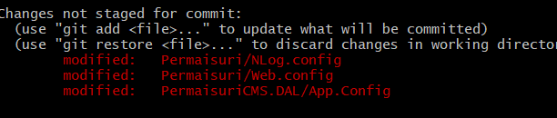

# Github入门笔记-PartH-删除所有commit历史记录
@(读书笔记组)[GitHub, GitHub 101, GitHub 漫游指南, Git工作流程, Github入门笔记]


[toc]

* [Github入门笔记\-删除所有commit历史记录](#github入门笔记-删除所有commit历史记录)
  * [操作](#操作)
  * [6\. References &amp; Connections](#6-references--connections)
  * [7\. 文档修订记录](#7-文档修订记录)


## 操作


```
$ git checkout --orphan=main
Switched to a new branch 'main'
```





```
git add -A
```

```
$ git commit -m "to avoid access key leaking"

[main (root-commit) cf13cd3] to avoid access key leaking
 1758 files changed, 352534 insertions(+)
 create mode 100644 .gitignore
 create mode 100644 CMSProjectsV2/NBCMS.BLL/NBCMS.BLL.csproj
 create mode 100644 CMSProjectsV2/NBCMS.BLL/Properties/AssemblyInfo.cs
 ......
```


```
$ git branch -D master
Deleted branch master (was d0364b1).
```

```
$ git branch -m master
```


```
$ git push -f origin master
```


## 6. References & Connections
1. [how to delete all commit history in github? --StatckOverflow](https://stackoverflow.com/questions/13716658/how-to-delete-all-commit-history-in-github)
2. [What is `git checkout --orphan` used for?--Stackoverflow](https://stackoverflow.com/questions/19980631/what-is-git-checkout-orphan-used-for)


## 7. 文档修订记录
| 版本号|     变化状态|   简要说明|  日期	|   参与者   |
| :-------- | :--------| :------ |:------ |:------ |
| V1.0|   建立| 文档初建|2021-3-21| Lee|

*变化状态：建立，修改，增加，删除


